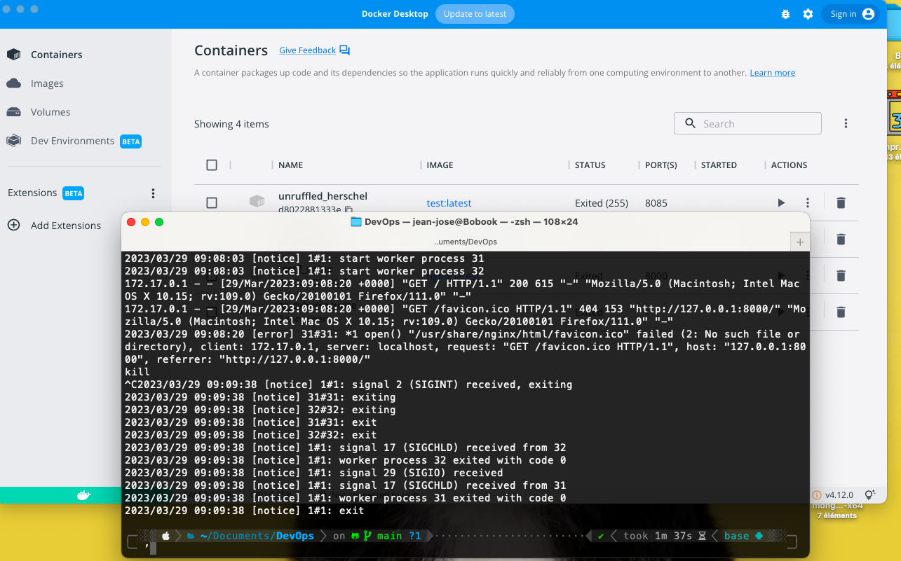

- ngnix fonction bien avec docker
  
- ```python
  docker run -p 8001:80 --name "test_nginx" nginx:nginx:1.22-alpine-slim     
  docker run -p 8000:80 --name "test2_nginx" nginx  
  ```
-
-
- test
	- py test controle sur un conteneur
- le build
	- amazon EcR pour stocker l'image docker
	- argo gere le versionning
	- kubernetes gere les ressources
	- git lab controle tout
-