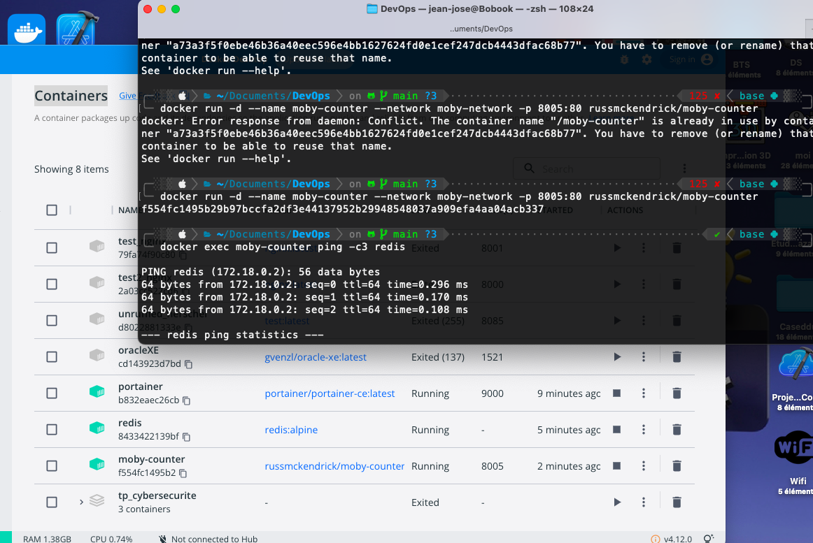
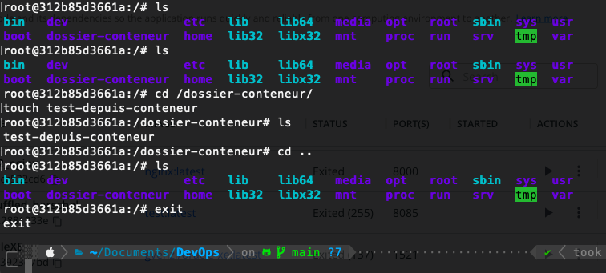
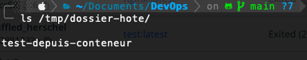

- on pull les 2 images
  
- on creer un network 
  
-
-
- La commande si-dessous on creer ,on rentre dans le cli et on créé un volume /tmp/dossier-hote dans l'hote :/dossier-conteneur qui est le dossier dans le conteneur
  `docker run -it -v /tmp/dossier-hote:/dossier-conteneur ubuntu /bin/bash`
  
	- On cree un fichier dans ce volume et on le quitte
	  
	  
	  
- execution de commande bash a l'intérieur d'un container
  `docker exec -it <container name> /bin/bash`
  par cette commande on peut géré tout depuis le terminal
	- 
-
- reussite une communication entre deux conteneur
  
-